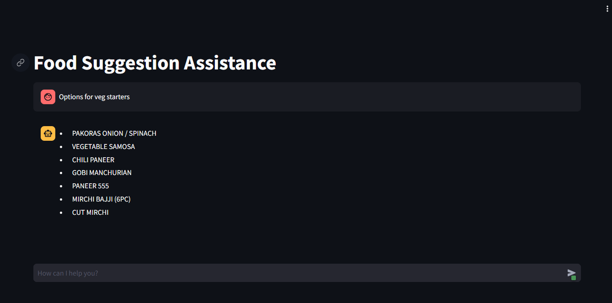
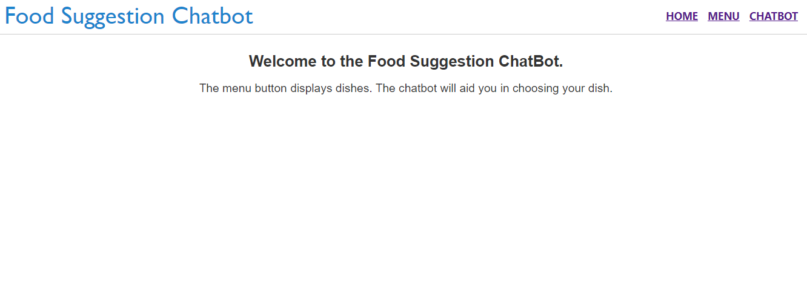

# Food Suggestion Application with Chatbot

We have developed a sophisticated Food Suggestion Chatbot utilizing Google Gemini-Pro. This Chatbot, featuring a Streamlit UI, is seamlessly integrated into a React Application.

Designed to assist customers in selecting suitable dishes, the Chatbot offers personalized suggestions based on individual preferences, mood, and specific requirements.

Additionally, users can view a comprehensive food menu within the React Application and have access to the functionalities provided by the Streamlit UI.

**Streamlit Output**



**React Output**


## Installation

**Chatbot using Streamlit only**

* Clone the repo
* Install the required packages
```shell
pip install -r requirements.txt
```
* Create a .env file to add GOOGLE_API_KEY
```shell
GOOGLE_API_KEY = 'YOUR_API_KEY'
```
* To run the Streamlit Application
```shell
streamlit run main.py
```

**Chatbot using React**

* Complete all the steps above.
* Get the Localhost number when you run the Streamlit.
* replace the Localhost number in this file location "food-chat\src\components\Chatbot.js"
```shell
src="http://localhost:8501/"
```
* Go inside the 'food-chat' folder in your terminal.
```shell
cd food-chat
```
* To install React Application and Run it.
```shell
npm install 
npm start
```

 
## Authors

- [@sasidhar](https://github.com/sastrysasi4)

